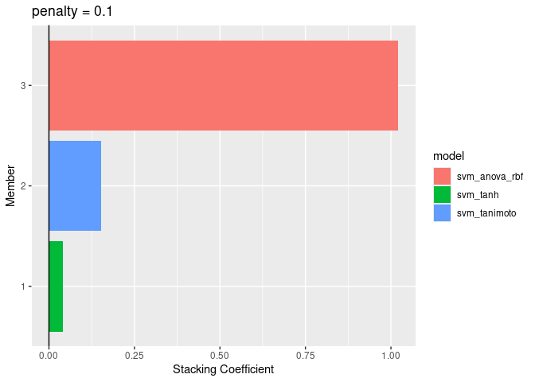
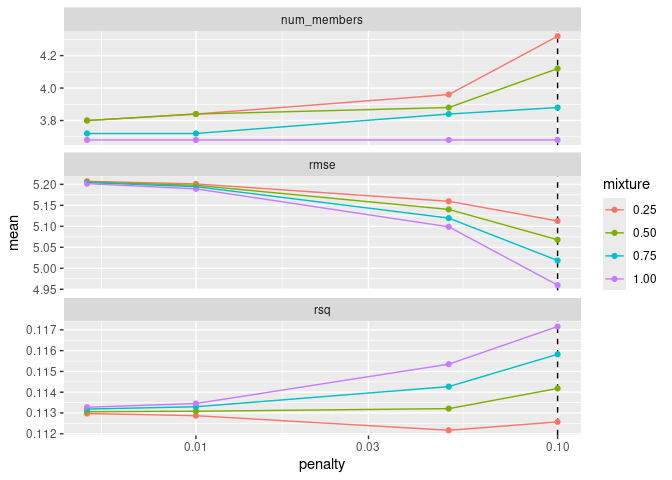

# maize & cherry blossoms


# Kyoto

### get

``` r
raw_kyoto <- "https://raw.githubusercontent.com/GMU-CherryBlossomCompetition/peak-bloom-prediction/refs/heads/main/data/kyoto.csv"

kyoto_df <- data.table::fread(raw_kyoto)
```

``` r
library(nasapower)
library(dplyr)
```


    Attaching package: 'dplyr'

    The following objects are masked from 'package:stats':

        filter, lag

    The following objects are masked from 'package:base':

        intersect, setdiff, setequal, union

``` r
library(ggplot2)
# library(openmeteo)

# via perplexity
carbon_data <- dput(data.frame(
  year = 2001:2025,
  co2 = c(371.13, 373.22, 375.77, 377.49, 379.80, 381.90, 383.76, 385.59, 387.37, 389.85, 
          391.63, 393.82, 396.48, 398.65, 400.83, 404.24, 406.55, 408.52, 411.44, 414.24, 
          416.45, 418.56, 419.30, 424.61, 426.50)
))
```

    structure(list(year = 2001:2025, co2 = c(371.13, 373.22, 375.77, 
    377.49, 379.8, 381.9, 383.76, 385.59, 387.37, 389.85, 391.63, 
    393.82, 396.48, 398.65, 400.83, 404.24, 406.55, 408.52, 411.44, 
    414.24, 416.45, 418.56, 419.3, 424.61, 426.5)), class = "data.frame", row.names = c(NA, 
    -25L))

``` r
kyoto_info <- kyoto_df |> head(1)

weather_df <- nasapower::get_power(community = "ag", 
                                   pars = c("T2M", "RH2M", "PRECTOTCORR"),
                                   temporal_api = "hourly", 
                                   lonlat = c(kyoto_info$long, kyoto_info$lat),
                                   dates = c("2001-01-01", "2024-04-10")
                                   )

readr::write_csv(kyoto_info, "kyoto_info.csv")
```

### FE EDA

``` r
february_metrics  <- weather_df |>
                     dplyr::filter(MO == 2) |>
                     dplyr::group_by(YEAR) |>
                     dplyr::summarize(
                       total_feb_precip = sum(PRECTOTCORR),
                       total_feb_rh     = sum(RH2M),
                       maxim_feb_temp   = max(T2M)
                     ) |>
                      janitor::clean_names()

last_freeze_df <- 
          weather_df |>
              dplyr::mutate(
                  freeze = ifelse(T2M < 0, 1, 0)
              ) |>
              dplyr::filter(MO <= 3) |>
              dplyr::group_by(YEAR) |> 
              dplyr::filter(freeze == 1) |> 
              slice_tail(n = 1) |>
              dplyr::mutate(
                freeze_date = lubridate::make_date(YEAR, MO, DY),
                freeze_yday = lubridate::yday(freeze_date)
              ) |>
            janitor::clean_names() |>
            dplyr::select(year, freeze_date, freeze_yday)


analysis_df <-
kyoto_df |>
  dplyr::mutate(
    bloom_date = as.Date(bloom_date)
  ) |>
  dplyr::left_join(february_metrics, by = c('year')) |>
  dplyr::left_join(last_freeze_df, by = c('year')) |>
  dplyr::select(-c(lat, long, alt, location)) |> 
  na.omit() |>
  # dplyr::mutate(
  #   distance_from_freeze = (as.numeric(bloom_date - freeze_date))
  # ) |>
  dplyr::select(-bloom_date, -freeze_date)

analysis_df |> 
  corrr::correlate() |>
  corrr::fashion() |>
  gt::gt() |>
  gt::as_raw_html()
```

    Correlation computed with
    • Method: 'pearson'
    • Missing treated using: 'pairwise.complete.obs'

<div id="pmriwzcebp" style="padding-left:0px;padding-right:0px;padding-top:10px;padding-bottom:10px;overflow-x:auto;overflow-y:auto;width:auto;height:auto;">
  &#10;  

| term | year | bloom_doy | total_feb_precip | total_feb_rh | maxim_feb_temp | freeze_yday |
|:--:|:--:|:--:|:--:|:--:|:--:|:--:|
| year |  | -.48 | -.24 | -.26 | -.12 | -.16 |
| bloom_doy | -.48 |  | .57 | .47 | .13 | .40 |
| total_feb_precip | -.24 | .57 |  | .67 | .38 | .39 |
| total_feb_rh | -.26 | .47 | .67 |  | .22 | .13 |
| maxim_feb_temp | -.12 | .13 | .38 | .22 |  | .20 |
| freeze_yday | -.16 | .40 | .39 | .13 | .20 |  |

</div>

## Recipe

``` r
library(rsample)
library(recipes)
```


    Attaching package: 'recipes'

    The following object is masked from 'package:stats':

        step

``` r
library(parsnip)
library(workflows)
library(finetune)
```

    Loading required package: tune

``` r
library(yardstick)

model_data <- analysis_df 

model_data <- model_data |>
              dplyr::left_join(carbon_data, by = 'year')

model_data <- model_data |>
              dplyr::filter(year != 2012)

# TRAIN/TEST prior to submission. 
# split ------------------------------
# time_split <- initial_time_split(model_data, prop = .92)
# 
# training <- training(time_split)
# testing  <- testing(time_split)
# 
# TRAINING IS MODEL_DATA FOR SUBMISSION
training <- model_data

folds <- rsample::vfold_cv(training, v = 10)

# recipe ------------------------------
bloom_recipe <- 
    recipes::recipe(bloom_doy ~ ., training) |>
    recipes::step_zv(all_nominal_predictors()) |>
    recipes::step_dummy(all_nominal_predictors()) |>
    recipes::step_normalize(all_nominal_predictors()) #|>
    #recipes::step_spline_b(distance_from_freeze)
```

## Tuning

``` r
# svm ----------------------------------------------------------------
# 
# grid, spec, extension pkgs: 
library(maize)
```


    Attaching package: 'maize'

    The following object is masked from 'package:parsnip':

        check_args

``` r
library(stacks)
library(kernlab)
```


    Attaching package: 'kernlab'

    The following object is masked from 'package:ggplot2':

        alpha

``` r
set.seed(92)
# LAPLACIAN ----------------------------------------------------------

svm_laplace_grid <- expand.grid(
  cost   = c(1, 2, 4, 5, 10),
  margin = c(1, .1),
  laplace_sigma = c(0.5, 1, 2, 5)
)

svm_laplace_spec <- svm_laplace(
  cost           = tune(),
  margin         = tune(),
  laplace_sigma  = tune()) |>
  set_engine("kernlab") |> 
  set_mode("regression")

laplace_svm_results <-
  tune_grid(
    workflow() |>
      add_recipe(bloom_recipe) |>
      add_model(svm_laplace_spec),
    resamples = folds,
    grid = svm_laplace_grid,
    control = stacks::control_stack_grid(),
    metrics = metric_set(yardstick::rmse)
  )


# TANH --------------------------------------------------------------

svm_tanh_grid <- expand.grid(
  cost   = c(1,  2,  4),
  margin = c(1, .1, .01)
)

svm_tanh_spec <- svm_tanh(
  cost   = tune(),
  margin = tune()) |>
  set_engine("kernlab") |> 
  set_mode("regression")

tanh_svm_results <-
  tune_grid(
    workflow() |>
      add_recipe(bloom_recipe) |>
      add_model(svm_tanh_spec),
    resamples = folds,
    grid = svm_tanh_grid,
    control = stacks::control_stack_grid(),
    metrics = metric_set(yardstick::rmse)
  )

# COSSIM ------------------------------------------------------------

svm_cossim_grid <- expand.grid(
  cost   = c(1, 2, 4, 5, 10),
  margin = c(1, .1, .01)
)

svm_cossim_spec <- svm_cossim(
  cost   = tune(),
  margin = tune()) |>
  set_engine("kernlab") |> 
  set_mode("regression")

cossim_svm_results <-
  tune_grid(
    workflow() |>
      add_recipe(bloom_recipe) |>
      add_model(svm_cossim_spec),
    resamples = folds,
    grid = svm_cossim_grid,
    control = stacks::control_stack_grid(),
    metrics = metric_set(yardstick::rmse)
  )

# CAUCHY ------------------------------------------------------------
svm_cauchy_grid <- expand.grid(
  cost   = c(1, 2, 4, 5, 10),
  margin = c(1, .1, .01)
)

svm_cauchy_spec <- svm_cauchy(
  cost   = tune(),
  margin = tune()) |>
  set_engine("kernlab") |> 
  set_mode("regression")

cauchy_svm_results <-
  tune_grid(
    workflow() |>
      add_recipe(bloom_recipe) |>
      add_model(svm_cauchy_spec),
    resamples = folds,
    grid = svm_cauchy_grid,
    control = stacks::control_stack_grid(),
    metrics = metric_set(yardstick::rmse)
  )

# T-STUDENT ---------------------------------------------------------
svm_tstudent_grid <- expand.grid(
  cost   = c(1, 2, 4),
  margin = c(1, .1, .01),
  degree = c(2, 3, 4)
)

svm_tstudent_spec <- svm_tstudent(
  cost   = tune(),
  margin = tune(),
  degree = tune()) |>
  set_engine("kernlab") |> 
  set_mode("regression")

tstudent_svm_results <-
  tune_grid(
    workflow() |>
      add_recipe(bloom_recipe) |>
      add_model(svm_tstudent_spec),
    resamples = folds,
    grid = svm_tstudent_grid,
    control = stacks::control_stack_grid(),
    metrics = metric_set(yardstick::rmse)
  )

# ANOVA RBF ---------------------------------------------------------
svm_anova_grid <- expand.grid(
  cost   = c(1, 2, 4),
  margin = c(1, .1, .01)
)

svm_anova_spec <- svm_anova_rbf(
  cost   = tune(),
  margin = tune()) |>
  set_engine("kernlab") |> 
  set_mode("regression")

anova_svm_results <-
  tune_grid(
    workflow() |>
      add_recipe(bloom_recipe) |>
      add_model(svm_anova_spec),
    resamples = folds,
    grid = svm_anova_grid,
    control = stacks::control_stack_grid(),
    metrics = metric_set(yardstick::rmse)
  )

# TANIMOTO ---------------------------------------------------------
svm_tanimoto_grid <- expand.grid(
    cost   = c(1, 2, 4),
  margin   = c(1, .1, .01)
)

svm_tanimoto_spec <- svm_tanimoto(
  cost   = tune(),
  margin = tune()) |>
  set_engine("kernlab") |> 
  set_mode("regression")

tanimoto_svm_results <-
  tune_grid(
    workflow() |>
      add_recipe(bloom_recipe) |>
      add_model(svm_tanimoto_spec),
    resamples = folds,
    grid = svm_tanimoto_grid,
    control = stacks::control_stack_grid(),
    metrics = metric_set(yardstick::rmse)
  )

# WAVELET ---------------------------------------------------------
svm_wavelet_grid <- expand.grid(
  cost   = c(1, 2, 4, 5, 10),
  margin = c(1, .1, .01)
)

svm_wavelet_spec <- svm_wavelet(
  cost   = tune(),
  margin = tune()
) |>
  set_engine("kernlab") |> 
  set_mode("regression")

wavelet_svm_results <-
  tune_grid(
    workflow() |>
      add_recipe(bloom_recipe) |>
      add_model(svm_wavelet_spec),
    resamples = folds,
    grid = svm_wavelet_grid,
    control = stacks::control_stack_grid(),
    metrics = metric_set(yardstick::rmse)
  )

# FOURIER ---------------------------------------------------------
svm_fourier_grid <- expand.grid(
    cost   = c(1, 2, 4, 5, 10),
  margin   = c(1, .1, .01)
)

svm_fourier_spec <- svm_fourier(
  cost   = tune(),
  margin = tune()
) |>
  set_engine("kernlab") |> 
  set_mode("regression")

fourier_svm_results <-
  tune_grid(
    workflow() |>
      add_recipe(bloom_recipe) |>
      add_model(svm_fourier_spec),
    resamples = folds,
    grid = svm_fourier_grid,
    control = stacks::control_stack_grid(),
    metrics = metric_set(yardstick::rmse)
  )
```

## kernel ensemble

``` r
kyoto_stacked_svm <- stacks() |>
                     add_candidates(laplace_svm_results) |>
                     add_candidates(tanh_svm_results) |>
                     add_candidates(cossim_svm_results) |>
                     add_candidates(cauchy_svm_results) |>
                     add_candidates(tstudent_svm_results) |>
                     add_candidates(anova_svm_results) |>
                     add_candidates(tanimoto_svm_results) |>
                     add_candidates(wavelet_svm_results) |>
                     add_candidates(fourier_svm_results)
```

    Warning: Predictions from 20 candidates were identical to those from existing candidates
    and were removed from the data stack.

    Warning: Predictions from 3 candidates were identical to those from existing candidates
    and were removed from the data stack.

    Warning: Predictions from 19 candidates were identical to those from existing candidates
    and were removed from the data stack.

    Warning: Predictions from 2 candidates were identical to those from existing candidates
    and were removed from the data stack.

``` r
kyoto_stacked_svm
```

    # A data stack with 9 model definitions and 110 candidate members:
    #   laplace_svm_results: 20 model configurations
    #   tanh_svm_results: 9 model configurations
    #   cossim_svm_results: 15 model configurations
    #   cauchy_svm_results: 12 model configurations
    #   tstudent_svm_results: 8 model configurations
    #   anova_svm_results: 7 model configurations
    #   tanimoto_svm_results: 9 model configurations
    #   wavelet_svm_results: 15 model configurations
    #   fourier_svm_results: 15 model configurations
    # Outcome: bloom_doy (integer)

``` r
the_kyoto_corncob <- 
  kyoto_stacked_svm |> 
  blend_predictions(penalty = c(.005, .01, .05, .1),
                    mixture = c(.25, .5, .75, 1),
                    non_negative = TRUE)

autoplot(the_kyoto_corncob, type = "weights")
```



``` r
autoplot(the_kyoto_corncob)
```



``` r
kyoto_corncob <- the_kyoto_corncob |> stacks::fit_members()
```

     Setting default kernel parameters  
     Setting default kernel parameters  

``` r
inpreds <- predict(kyoto_corncob, training)

training |>
  bind_cols(inpreds) |>
  select(year, bloom_doy, .pred) |> 
  gt::gt() |>
  gt::as_raw_html()
```

<div id="gfmergyscb" style="padding-left:0px;padding-right:0px;padding-top:10px;padding-bottom:10px;overflow-x:auto;overflow-y:auto;width:auto;height:auto;">
  &#10;  

| year | bloom_doy |    .pred |
|-----:|----------:|---------:|
| 2001 |        96 | 96.25567 |
| 2002 |        91 | 94.92035 |
| 2003 |        98 | 96.44891 |
| 2004 |        92 | 94.81026 |
| 2005 |        99 | 94.98411 |
| 2006 |        98 | 93.73880 |
| 2007 |        97 | 96.12416 |
| 2008 |        95 | 93.04836 |
| 2009 |        95 | 94.73956 |
| 2010 |        95 | 93.76102 |
| 2011 |        99 | 96.72078 |
| 2013 |        93 | 97.27038 |
| 2014 |        94 | 92.44381 |
| 2015 |        93 | 92.50023 |
| 2016 |        95 | 96.54518 |
| 2017 |        99 | 95.61294 |
| 2018 |        89 | 91.12934 |
| 2019 |        95 | 90.58751 |
| 2020 |        92 | 94.03139 |
| 2021 |        85 | 88.94817 |
| 2022 |        91 | 90.01667 |
| 2023 |        84 | 88.48097 |
| 2024 |        95 | 92.98812 |

</div>

``` r
# removed testing for submission
# preds <- predict(kyoto_corncob, testing)
# 
# testing |>
#   bind_cols(preds) |>
#   select(year, bloom_doy, .pred) |> 
#   gt::gt() |>
#   gt::as_raw_html()
```

``` r
# membr_preds <- predict(kyoto_corncob, testing, members = TRUE)
# 
# testing |>
#   bind_cols(membr_preds) |>
#   select(year, bloom_doy, .pred:last_col()) |>
#     gt::gt() |>
#     gt::as_raw_html()
```

### 2025 predictions

nasapower doesn’t have recent weather (?). Using openmeteo to get recent
actuals. SVMs for imputing and predicting other xregs.

``` r
# LAST FREEZE SVM --------------------------------------------------------------------------------------

# model params --
svm_last_freeze <- 
    svm_wavelet(cost = 1, margin = 0.1) |> 
    set_mode("regression") |>
    set_engine("kernlab")

# fit --
svm_freeze_fit <- svm_last_freeze |> fit(freeze_yday ~ year, data = ungroup(last_freeze_df))

freeze_pred <- predict(svm_freeze_fit, data.frame(year = 2025))

# TOTAL PRECIPITATION SVM -------------------------------------------------------------------------------

# model params --
svm_total_precip <- 
    svm_sorensen(cost = 1, margin = 0.1) |> 
    set_mode("regression") |>
    set_engine("kernlab")

# fit --
svm_precip_fit <- svm_total_precip |> fit(total_feb_precip ~ year, data = february_metrics)

precip_pred <- predict(svm_precip_fit, data.frame(year = 2025))

# X REGs for SVM Stack ----------------------------------------------------------------------------------

recent_weather_df <- openmeteo::weather_history(location = c(kyoto_info$lat, kyoto_info$long),
                                                start  = "2025-02-01",
                                                end    = "2025-02-26",
                                                hourly = c("temperature_2m", "precipitation", "relative_humidity_2m") 
                                                )

weight <- 28/26

recent_february_metrics <- recent_weather_df |>
                           summarize(
                             maxim_feb_temp   = max(hourly_temperature_2m, na.rm = TRUE),
                             total_feb_rh     = sum(hourly_relative_humidity_2m, na.rm = TRUE) * weight
                              # NASA's PRECTOTCORR does not align with openmeteo historically. 
                             #total_feb_precip = sum(hourly_precipitation, na.rm = TRUE) * weight,
                             # impute method instead of using openmeteo 
                             # total_feb_precip = february_metrics$total_feb_precip |> tail(3) |> mean(),
                           ) |>
                          mutate(year = 2025,
                                 co2  = 426.5)


recent_february_metrics <- recent_february_metrics |>
                           mutate(
                             freeze_yday = freeze_pred$.pred,
                             total_feb_precip = precip_pred$.pred
                           )


recent_february_metrics |>
  gt::gt() |>
  gt::as_raw_html()
```

<div id="imlscoifhl" style="padding-left:0px;padding-right:0px;padding-top:10px;padding-bottom:10px;overflow-x:auto;overflow-y:auto;width:auto;height:auto;">
  &#10;  

| maxim_feb_temp | total_feb_rh | year |   co2 | freeze_yday | total_feb_precip |
|---------------:|-------------:|-----:|------:|------------:|-----------------:|
|           12.9 |     45129.54 | 2025 | 426.5 |    83.90242 |         2011.573 |

</div>

### 2025 prediction via stacked members

the members themselves are weighted for the point forecast, but
predicting all members for capturing intervals.

``` r
membr_preds <- predict(kyoto_corncob, recent_february_metrics, members = TRUE)

lb <- membr_preds |> t() |> min()
ub <- membr_preds |> t() |> max()


final_preds <- data.frame(
  location = "kyoto",
  prediction = membr_preds$.pred,
  lower      = lb,
  upper      = ub
)

readr::write_csv(final_preds, "kyoto_preds.csv")

final_preds |>
  gt::gt() |>
  gt::as_raw_html()
```

<div id="uonsuqqnjs" style="padding-left:0px;padding-right:0px;padding-top:10px;padding-bottom:10px;overflow-x:auto;overflow-y:auto;width:auto;height:auto;">
  &#10;  

| location | prediction |    lower |    upper |
|:---------|-----------:|---------:|---------:|
| kyoto    |   92.56584 | 90.66296 | 124.3727 |

</div>
